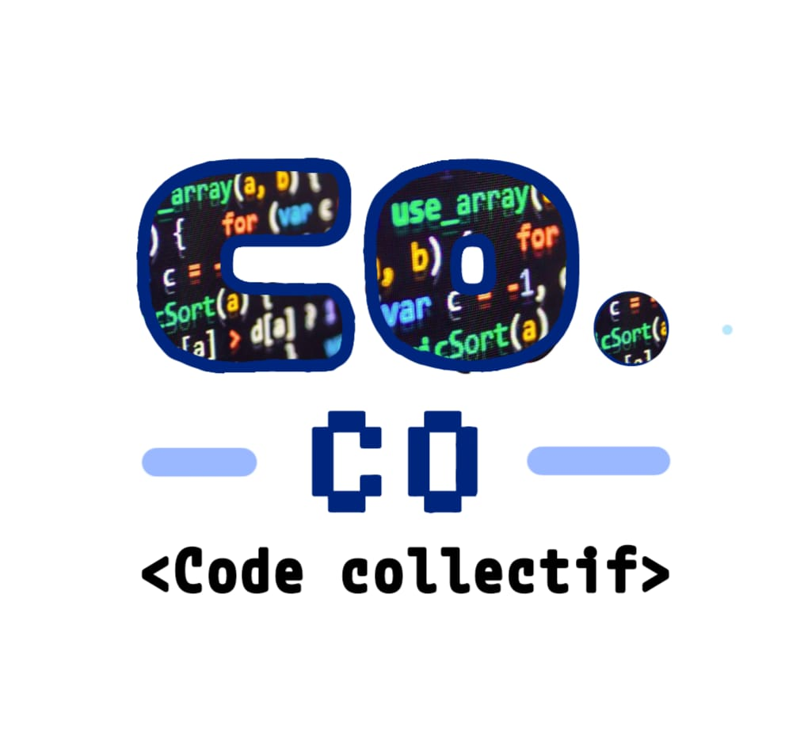

<header class="header-container">
    
    <h1>Code Collectif</h1>
    <nav class="menu">
        <ul>
            <li><a href="#">Accueil</a></li>
            <li><a href="projets.html">Projets</a></li>
            <li><a href="activites.html">Activités</a></li>
            <li><a href="#">Partenaires</a></li>
            <li><a href="https://www.helloasso.com/associations/code-collectif">Adhérer</a></li>
        </ul>
    </nav>
</header>

<main>








</main>
<footer class="footer-container">
    
&copy; 2025 Code Collectif

    
Site hébergé sur un VPS IKOULA
        
    

    
<a href="#">Nous contacter</a>

</footer>
