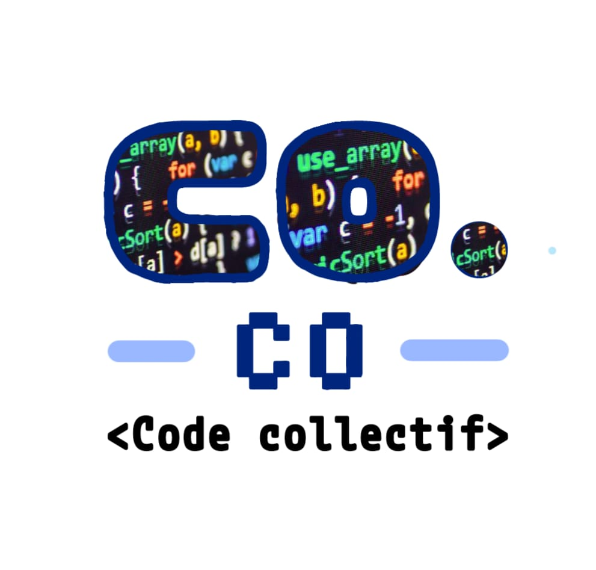

<header class="header-container">
    
    <h1>Code Collectif</h1>
    <nav class="menu">
        <ul>
            <li><a href="#">Accueil</a></li>
            <li><a href="projets.md">Projets</a></li>
            <li><a href="activites.md">Activités</a></li>
            <li><a href="#">Partenaires</a></li>
            <li><a href="https://www.helloasso.com/associations/code-collectif">Adhérer</a></li>
        </ul>
    </nav>
</header>

<main>
    <section class="container-projets">
        <h2 class="soustitre">Les projets</h2>
        

            Ici on peut mettre un texte explicatif pour décrire nos attentes vis-à-vis des projets
            proposés, les conditions à respecter.
            Et donner des informations essentielles comme par exemple ce qu'il est possible ou non de faire.
        

    </section>

    <section class="container-formulaire">
        <h2 class="soustitre">Nous proposer un projet ?</h2>
        <form action="/submit" method="POST">
            

                <label for="name">Votre Nom :</label>
                <input type="name" id="name" name="name" required placeholder="Entrez votre nom">
            

            

                <label for="email">Votre Email :</label>
                <input type="email" id="email" name="email" required placeholder="Entrez votre email">
            

            

                <label for="project-name">Le nom du projet :</label>
                <input type="text" id="project-name" name="project-name" required placeholder="Nom du projet">
            

            

                <label for="message">Message :</label>
                <textarea id="message" name="message" rows="4" cols="50" placeholder="Entrez votre message" required></textarea>
            

            <button type="submit">Envoyer</button>
        </form>
    </section>
</main>

<footer class="footer-container">
    
&copy; 2025 Code Collectif

    
Site hébergé sur un VPS IKOULA
        
    

    
<a href="#">Nous contacter</a>

</footer>
